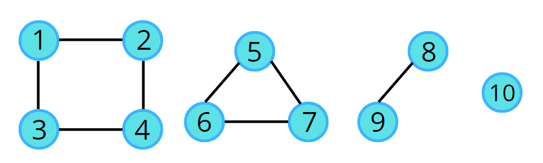

# Graph Data Structure 🧑🏻‍💻

## Connected Components 🧩



- **Always make a `visited array` to keep track of visited nodes**.
- For each node, if it is not visited, call the `dfs` function or whatever operation you need.
> This will help you to avoid visiting the disconnected components.

```cpp
bool visited[MAX_NODES]={false};

for(int i=0; i<MAX_NODES; i++){
    if(!visited[i]){
        dfs(i); // or whatever operation you need
    }
}
```

---

